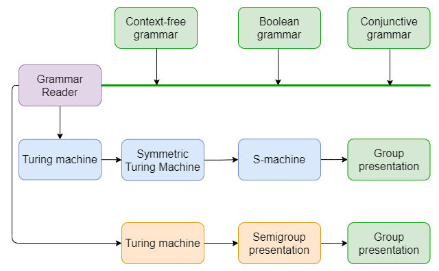

# LangToGroup

This project provides an opportunity to build a grammar group representation in two ways, which is displayed in the following picture:



## First approach
Implementation of [Isoperimetric and Isodiametric Functions of Groups](https://arxiv.org/abs/math/9811105) in Haskell.

Implementation algorithm building the presentation of the group for a formal language with the preservation of the language. The implementation of this algorithm is necessary for research in the field of formal languages with the involvement of the group-theoretical methods. At present, there are only theoretical works showing the possibility of such construction, however, the algorithm and its implementation are absent up to this point. As far as we know, this implementation is the first in its area.  

## Second approach
Implementation of building Turing machine by boolean grammar algorithm, described in [Boolean grammars](https://doi.org/10.1016/j.ic.2004.03.006) and algorithm, descrbied in [An Introduction to the Theory of Groups](https://doi.org/10.1007/978-1-4612-4176-8), which by given Turing machine builds group presentation via building semigroup presentation.

## Modifications of second approach
There are two modifications of second approach, which produce a more compact
group presentation, but this modifications haven't strict theoretical proof of
saving properties of original approach. So, use them if size of group
presentation is more important than theoretical properties.

This modifications of second approach use modified conversions from Turing machine to semigroup representation (here `G` is set of generators and `R` is set of relations of produced semigroup presentation):

### Original conversion (in `second` approach)
This conversion is represented in [An Introduction to the Theory of Groups](https://doi.org/10.1007/978-1-4612-4176-8)


### First modified conversion (in `second_a` approach)
This conversion uses the same set of generators as the original, but smaller size of set of relations


### Second modified conversion (in `second_b` approach)
This conversion uses different set of generators as opposed to the first conversion


## Build status
[](https://travis-ci.org/YaccConstructor/LangToGroup)

## Building 
To build run:

``stack build``

## Testing
For run the tests:

``stack test``

## Usage
```bash
stack run -- LangToGroup-cli
```

```
Usage: LangToGroup-cli <options>

Options:
  -i file_path  --input=file_path    Full path to file with grammar definition
  -o file_path  --output=file_path   Full path to file for printing results
  -e file_path  --error=file_path    Full path to file, where errors should be recorded during parsing
  -a approach   --approach=approach  Used approach (see section `Approaches`)
  -L            --LaTeX              Print result in LaTeX format (while doesn't work)
  -I objects    --info=objects       Print useful information about objects (see section `Objects`)
  -h            --help               Print help and exit

Approaches:
  first
    Implementation of algorithm from "Isoperimetric and Isodiametric Functions of Groups"
  second
    Implementation of algorithms from "Boolean grammars" and "An Introduction to the Theory of Groups"
  second_a
    Modifications of `second` approach with modified algorithm from "An Introduction to the Theory of Groups"
  second_b
    Modifications of `second` approach with modified algorithm from "An Introduction to the Theory of Groups"

Objects:
  grammar
    Input grammar (context-free, conjunctive or boolean)
  turing_machine, tm
    Produced Turing machine (its type depends on used approach)
  group_prsentation, gp
    Produced group presentation
Note: When enumerating objects, they must be separated by commas

For more information see https://github.com/YaccConstructor/LangToGroup/blob/master/README.md
```

For example, if you want build presentation of grammar via second modification of the second approach and get metrics of produced group presentation, you should type options:
`-i grammar.txt -a second_b -I grammar,turing_machine,group_presentation`

And if you want to build presentation of grammar via first approach and save produced group presentation to file, you should type options:
`-i grammar.txt -o group_presentation.txt -a first`

Examples of grammar files given below.

**Boolean grammar**

    S; S Sa; c v b
    S-> c&! v&! Sa&! Eps
    Sa->! b
    S-> a& b&! v&! Sa&! Eps
**Conjunctive grammar**

    S; S Abc D Cr; c b d e
    S-> D c& d Abc
    Abc-> b
    D-> Cr
    Cr-> e
**Context-free grammar**

    S; S A D1; c2 b e
    S-> c2 D1 A
    A-> b
    D1-> e

## Experiments
Here are the tables with some examples of building group presentations by different grammars, where:
- **States** -- number of states in built Turing machine, 
- **Gen** -- number of generators, 
- **Rel** -- number of relations, 
- **N** -- number of rules in normal grammar.

### Running experiments for the first approach

| Language | Grammar | N | States | Generators | Relations | 
| -- | -- |-- | -- | -- | --|
| 1 rule | CFG | 1 | 6 | 89508 | 56187 |
| Dyck language without empty word| CFG | 10 | 77 | 2798322 | 1773449 |
|  | CFG| 2 | 10 | 228160 | 129611 | 
|  | CFG| 5 | 63 |  2241518 | 1355357 | 


### Running experiments for the second approach

| Language | Grammar | N | States | Generators | Relations | 
|----------|---------|---|------------|-----------| --|
| 1 rule | CFG | 1 | 120 | 2300 | 28171 |
| Dyck language without empty word | CFG | 10 | 943 | 40414 | 1025570 |
|  | CFG| 2 | 221 |  7384 | 149982 | 
|  | CFG| 5 | 719 |  29510 | 719150 | 
|  | Conjunctive | 14 | 3459 |  179112 | 5619872 | 
| | Boolean| 14 | 2498 | 125587 | 3691770 |
|  | Boolean | 14 | 3461 |185307 | 5999829| 

### Running experiments for the second approach, modification `a`
| Language | Grammar | N | States | Generators | Relations | 
|----------|---------|---|------------|-----------| --|
| 1 rule | CFG | 1 | 120 | 1564 | 18603 |
| Dyck language without empty word| CFG | 10 | 943 | 19221 | 474552 |
|  | CFG| 2 | 221 | 4193 | 82971 | 
|  | CFG| 5 | 719 |  14350 | 340150 | 
|  | Conjunctive | 14 | 3459 |  79023 | 2417024 | 
| | Boolean| 14 | 2498 | 58360 | 1674960 |
|  | Boolean | 14 | 3461 |81376 | 2570106| 

### Running experiments for the second approach, modification `b`
| Language | Grammar | N | States | Generators | Relations | 
|----------|---------|---|------------|-----------| --|
| 1 rule | CFG | 1 | 120 | 881 | 8164 |
| Dyck language without empty word | CFG | 10 | 943 | 7506 | 145444 |
|  | CFG| 2 | 221 |  1683 | 25620 | 
|  | CFG| 5 | 719 |  5701 | 105950 | 
|  | Conjunctive | 14 | 3459 | 27624 | 661568 | 
| | Boolean| 14 | 2498 | 20200 | 455220 |
|  | Boolean | 14 | 3461 | 27655 | 683100 | 


## Execution 

For run experiments and print its numerical results you can use ``is_det <bool>`` flag.

So, for print experiments' results using deterministic symmetrization:

``stack exec -- LangToGroup-printer --is_det true``

using nondeterministic symmetrization:

``stack exec -- LangToGroup-printer --is_det false``


### Printing example transformations in LaTeX
Grammar's transformations also can be printed in LaTeX. For this should be used ``--print_example <grammar>`` flag.
The following grammars can be used as print examples: "one\" --- one rule grammar, \"a*\" --- grammar for regular language 

, \"dyck\" --- Dyck language grammar. 

For example,

``stack exec -- LangToGroup-printer --is_det true --print_example one``

Output filename can be specified by ``-o <filename>`` flag.

### Printing example group presentation in Gap-format file
For this you can use ``-G`` flag without a parameter, but with ``--is_det <bool>`` and ``--print_example <grammar>`` flags.
Also, output filename can be specified by ``-o <filename>`` flag, if it does not speccified it been printing with default filename "out.txt".

For example, following prints in "out.txt" a group presentation, which obtained from Dyck language grammar using nondeterministic symmetrization: 

``stack exec -- LangToGroup-printer -G --is_det false --print_example dyck``


    
